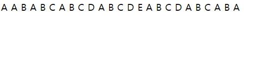

>>1113

C:\Users\dlwla\Desktop\git\webPG\1113\problem4.php

### 문제 4: 삼항 연산자를 사용한 홀수 또는 짝수 확인 프로그램
- [닷홈 링크](http://dlwlals3456.dothome.co.kr/problem4.php)

### 문제 5: 삼항 연산자를 사용한 홀수 또는 짝수 확인 프로그램
- [닷홈 링크](http://dlwlals3456.dothome.co.kr/problem5.php)

### 문제 6: 삼항 연산자를 사용한 홀수 또는 짝수 확인 프로그램
- [닷홈 링크](http://dlwlals3456.dothome.co.kr/problem6.php)

### 문제 7: 삼항 연산자를 사용한 홀수 또는 짝수 확인 프로그램
- [닷홈 링크](http://dlwlals3456.dothome.co.kr/problem7.php)

### 문제 8: 삼항 연산자를 사용한 홀수 또는 짝수 확인 프로그램
- [닷홈 링크](http://dlwlals3456.dothome.co.kr/problem8.php)

